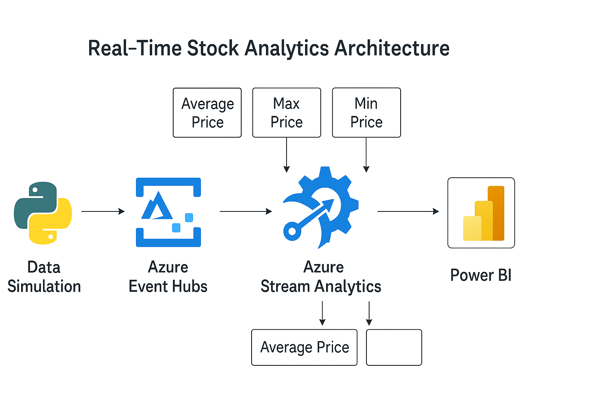

# 📊 Real-Time Stock Analytics on Azure

This project showcases a complete real-time data pipeline using **Azure Event Hubs**, **Azure Stream Analytics**, **Azure Data Lake**, and **Power BI**, built using **Terraform** and **Python**.

## 🚀 Architecture Overview


Stock Data Simulator → Event Hub → Stream Analytics Job → Power BI Dashboard

## 📂 Folder Structure

real-time-stock-analytics/
│
├── infra/ # Infrastructure-as-Code with Terraform
├── data-simulation/ # Python script that sends simulated stock data
├── stream-analytics/ # ASA query used to aggregate and analyze data
├── dashboards/ # Dashboard screenshots or .pbix exports
├── .gitignore
└── README.md


## ⚙️ Tech Stack

- **Azure Event Hubs** – Real-time ingestion of stock data
- **Azure Stream Analytics** – Real-time windowed aggregations
- **Power BI** – Real-time dashboards
- **Terraform** – Infrastructure provisioning
- **Python** – Data simulator (simulated stock prices)

## 📈 Stream Analytics Output Fields

| Field       | Description                    |
|-------------|--------------------------------|
| symbol      | Stock ticker (AAPL, GOOGL...)  |
| event_time  | Timestamp of window            |
| avg_price   | Average price in the window    |
| max_price   | Maximum price in the window    |
| min_price   | Minimum price in the window    |

## 📊 Power BI Dashboard Features

- Real-time cards for **Average, Max, Min Prices**
- Gauge visual for **live price tracking**
- Line chart to monitor **per-symbol trends**
- Alerts for **threshold breaches** (e.g. Price > 200)

## 🧪 Simulate Stock Data

```bash
cd data-simulation
pip install -r requirements.txt
python simulate_stocks.py

```

## 🛠 Infrastructure Deployment

```bash
cd infra
terraform init
terraform apply

``` 

## 🧠 Insights

This project demonstrates how to:

Build a real-time pipeline using Azure services

Use analytic functions in Stream Analytics

Push real-time data into Power BI

